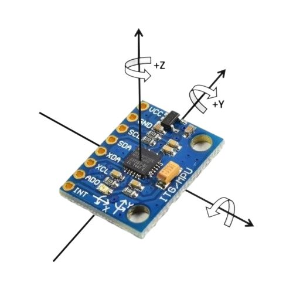
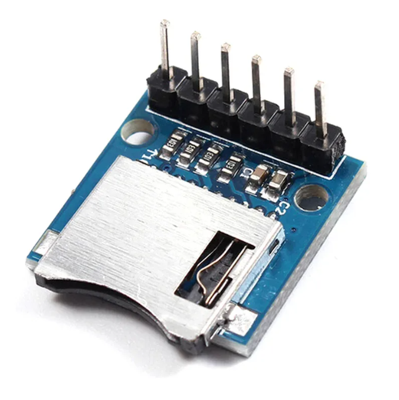

## MPU6050
Датчик, который позволит определить положение нашей [[ElizabethRocket|ракеты]] в пространстве. С помощью него мы сможем определить момент, когда нужно [[Система разделения ступеней|отделать первую ступень]] и [[Парашютная система|раскрывать парашют]].

Это устройство позволяет определять 6 степеней свободы (6 DoF): 3 поступательные (за счёт акселерометра, который определяет проекции вектора ускорения на оси X, Y, Z) и 3 вращательные (за счёт гироскопа, который определяет угловую скорость вокруг этих осей). 

### Подключение к микроконтроллеру
Модуль использует интерфейс I2C для общения с микроконтроллером.

| MPU6050 | Raspberry Pico                   |
| ------- | -------------------------------- |
| VCC     | 3V3                              |
| GND     | GND                              |
| SCL     | GPIO4 (или любой другой pin SCL) |
| SDA     | GPIO5 (или любой другой pin SDA) |
### Применение в проекте

| Этап полёта       | Измерение                         | Действие                                                                                     |
| ----------------- | --------------------------------- | -------------------------------------------------------------------------------------------- |
| Старт             | Резкое ускорение по оси Z         | Запуск сбора телеметрии и логики полёта                                                      |
| Набор высоты      | Угол тангажа                      | Если угол сильно растёт, то ступени не разделяем, раскрываем основной парашют и приземляемся |
| Выгорание топлипа | Падение ускорения                 | Сигнал для [[Система разделения ступеней\|отделения ступени]]                                |
| Апогей            | Смена знака вертикальной скорости | Сигнал для [[Парашютная система\|раскрытия парашюта]]                                        |
| Спуск             | Ускорение по оси Z ~1g            | Сбор телеметрии                                                                              |
| Посадка           | Пик ускорения за счёт удара       | Окончание сбора телеметрии и логики полёта                                                   |
# CD-V474
Модуль, который будет хранить телеметрию при запуске.

### Подключение к микроконтроллеру
Модуль использует интерфейс SPI для общения с микроконтроллером.

| MPU6050 | Raspberry Pico |
| ------- | -------------- |
| 3V3     | 3V3            |
| CS      |                |
| MOSI    |                |
| CLK     |                |
| MISO    |                |
| GND     | GND            |
