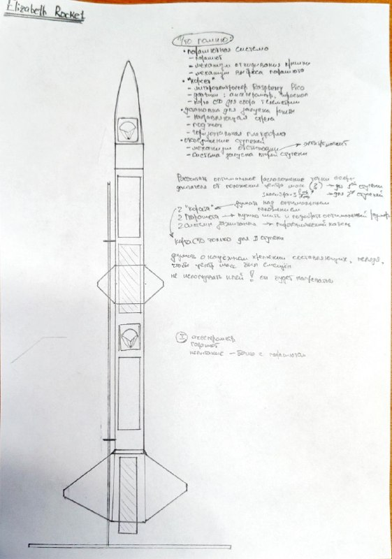

# Двухступенчатая ракета с электромагнитной системой разделения

## Обзор проекта

Проект представляет собой любительскую двухступенчатую ракету, корпус которой выполнен из пластика (3D-печать). Главная особенность — экспериментальная система разделения ступеней на основе электромагнитов, управляемая электроникой.

## Ключевые технические решения

### Моделирование

- Проектирование в **OpenRocket** с пользовательскими материалами (PLA/PETG/ABS)
- Расчёт остойчивости с коэффициентом 1.5–2.0
- Точное внесение масс реальных компонентов

### Система разделения ступеней

- **Электромагнитная муфта**: катушки на обеих ступенях, питание током одного направления для сцепления
- **Двухэтапное разделение**:
  1. Подача обратного импульса тока для активного отталкивания ступеней
  2. Запуск двигателя второй ступени для гарантированного ухода
- Управление на основе акселерометра или таймера (микроконтроллер)

### Конструкция

- Материалы: пластик для корпуса, ферромагнитные сердечники для катушек
- Продуманный стыковочный узел, исключающий попадание газов двигателя в первую ступень
- Парашютные системы для возврата обеих ступеней

## Статус

Проект находится на этапе концептуальной проработки и математического моделирования. Следующие шаги — создание стенда для испытаний парашютной системы и магнитной муфты.

---

*Проект вдохновлён современными исследованиями в области альтернативных методов разделения ступеней (NASA Space Apps, патенты на электромагнитные муфты).*